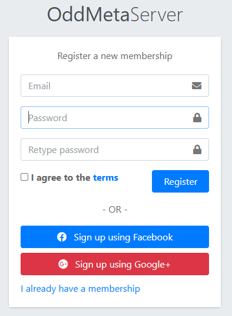

# 注册账号

## 1. 注册账号
在使用小落同学之前，你需要先注册一个账号。注册账号的过程非常简单，只需要填写一些基本信息，如姓名、邮箱、密码等。注册成功后，你就可以开始使用小落同学了。

## 2. 注册页面


后台使用标准的Django认证系统，用户可以通过以下方式注册：

jango认证系统，用户可以通过以下方式注册：

1. 访问注册页面：`URL_ADDRESS1. 访问注册页面：`http://localhost:8000/api/admin/register.html`
2. 填写用户名和密码，然后提交表单。
3. 如果注册成功，用户将被重定向到登录页面。
4. 如果注册失败，可能是因为用户名已经存在或者其他验证错误。

注意：
- 注册过程中，用户名和密码是必填的，不需要其他任何个人信息。
- 用户名必须是唯一的，并且不能包含空格。
- 密码必须至少包含8个字符，并且不能包含空格。
- 注册过程中，密码将被加密存储，在django安全机制下不支持找回密码，只能重置。

暂时不准备做手机号码+验证进行注册，也不准备在账号信息系统里加入手机号码。

## 3. 注册API

注册API是一个POST请求，用于创建新用户。

Request

```http
POST /api/admin/register.html HTTP/1.1
Host: localhost:8000
Content-Type: application/json
{
    "username": "newuser",
    "password": "newpassword"
}
```

Response

```http
Response: 201 Created
{
    "message": "User registered successfully"
}
```


http://localhost:8000/api/admin/register.html
