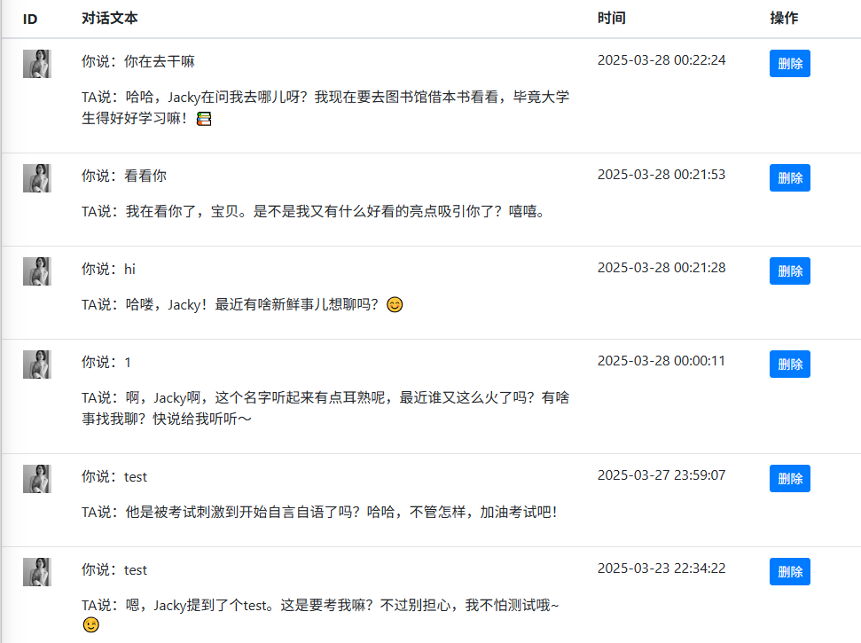

# 记忆管理

## 1. 记忆的生成
在创建了角色后，你可以开始与角色进行对话。所有的对话记录都会保存在短时记忆里，包括：
1. 你自己跟你创建的角色之间的对话。
2. 你跟其他人创建的、但是是公开的角色之间的对话。
3. 如果你创建的角色是公开的，那么其他人也可以跟你创建的角色进行对话。

## 2. 记忆的使用
在使用角色时，会通过以下方式使用记忆：
1. 在对话中会有对话的上下文，这个上下文的长度，一方面受限于后台大模型所支持的最大上下文的长度，另一方面也跟系统的记忆管理策略有关。
2. 系统会根据对话的上下文，生成记忆。
3. 系统会根据记忆，生成对话的回复。
4. 系统会根据对话的回复，生成记忆。
5. 系统会根据记忆，生成对话的回复。
6. 以此类推，直到对话结束。

## 3. 记忆的管理
保存的记忆是一个列表，在后台管理系统中，你可以查看和管理记忆。
记忆的管理包括：
- 1. 查看记忆。
    - 1）如果你是这个角色的所有者：你可以查看所有与你创建的角色的对话记录，包括你自己与TA的对话记录，以及其他人与TA的对话记录。
    - 2）如果你不是这个角色的拥有者，且该角色是公开角色：你可以查看你跟该公开角色的聊过的记忆数据。
- 2. 删除记忆。
    - 1）如果你是这个角色的所有者：你可以删除所有与你创建的角色的对话记录，包括你自己与TA的对话记录，以及其他人与TA的对话记录。
    - 2）如果你不是这个角色的拥有者，且该角色是公开角色：你可以删除你跟该公开角色的聊过的记忆数据。
