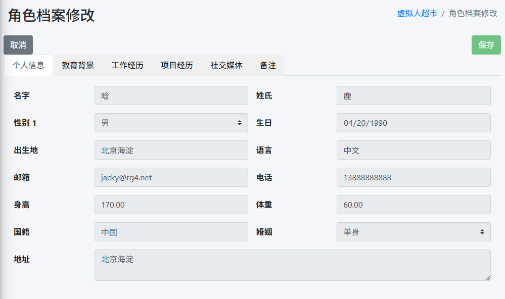

# 智能体角色档案

在创建了一个智能体角色后，你可以通过以下方式查看和管理角色的档案。

## 查看角色档案

1. 进入智能体角色的编辑页面。
2. 在页面右侧的“角色档案”选项卡中，你可以查看角色的基本信息、背景故事、个性特点等。

## 编辑角色档案

1. 进入智能体角色的编辑页面。
2. 在页面右侧的“角色档案”选项卡中，你可以编辑角色的基本信息、背景故事、个性特点等。
3. 点击“保存”按钮，保存你的编辑。

