# 点滴清单软件说明书

## 一、软件概述

### 1.1 软件名称

点滴清单

### 1.2 软件版本

V1.3

### 1.3 软件简介

点滴清单是一个功能完善的提醒管理系统，支持生日提醒、节日提醒、闹钟、待办事项等多种提醒类型，采用Django后端 + Web前端 + Android客户端 + Electron桌面端的架构设计。

### 1.4 目标用户

- 需要管理生日、节日等重要日期的个人用户
- 需要待办事项管理的办公用户
- 需要定时提醒服务的各类用户

## 二、技术架构

### 2.1 系统架构
本软件采用前后端分离架构，包含以下组件：
- **后端服务**：Django + Django REST Framework + Channels（WebSocket）
- **前端Web**：HTML5 + JavaScript（响应式设计，支持PC和移动端）
- **Android客户端**：原生Android（WebView）
- **桌面客户端**：Electron框架

### 2.2 核心技术栈
| 层次     | 技术                         |
| -------- | ---------------------------- |
| 后端框架 | Django 4.2+                  |
| API      | Django REST Framework        |
| 实时通信 | Django Channels (WebSocket)  |
| 数据库   | SQLite3 / MySQL / PostgreSQL |
| 任务队列 | Django management commands   |
| Android  | Java, WebView                |
| 桌面端   | Electron                     |
| 前端     | HTML5, JavaScript            |

## 三、功能特性

### 3.1 用户管理

- 用户注册与登录

打开《点滴清单》App后，可以进行账号注册，账号注册支持：用户名、邮箱、手机号三种方式注册，但是推荐使用邮箱注册，方便以邮件的方式接收通知。

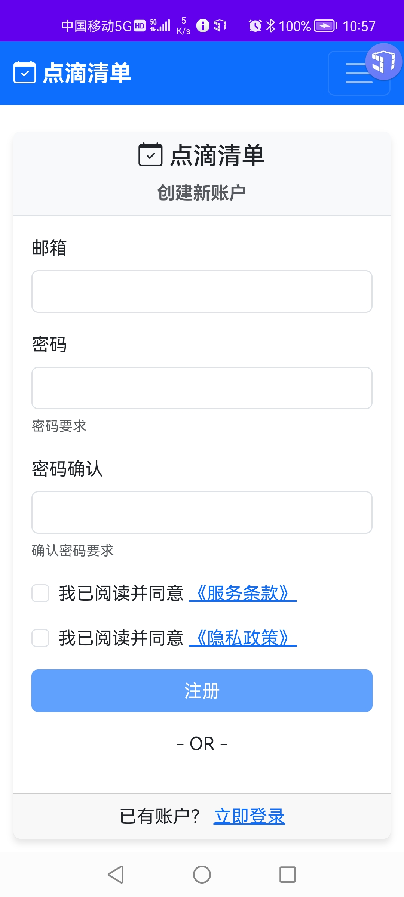

用户成功注册了点滴清单的账号后，可以在登录界面进行登录

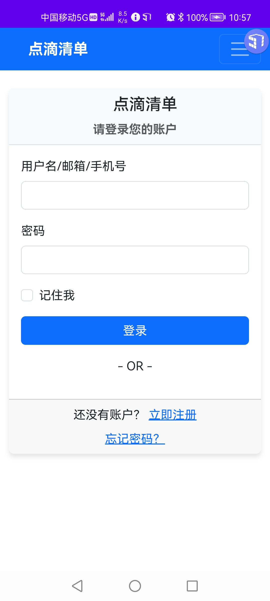

- 密码修改与重置

如果用户忘记了密码，可在登录、注册界面选择找回密码。

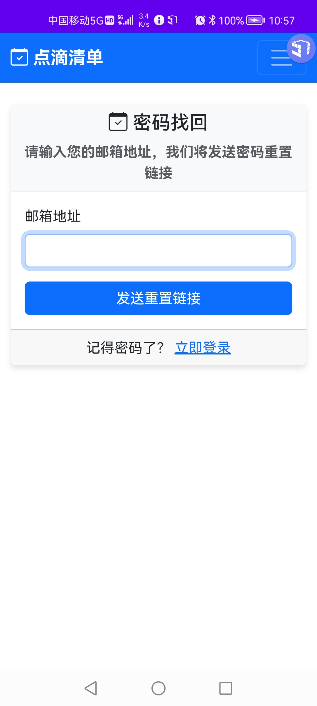

- 用户资料管理

用户登录了点滴清单后，可以个人信息界面查看自己相关的注册信息。

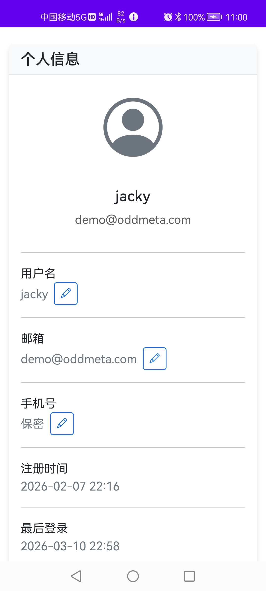

并且可以在**个人信息**界面的下方查看点滴清单相关的**隐私政策**和**用户协议**。

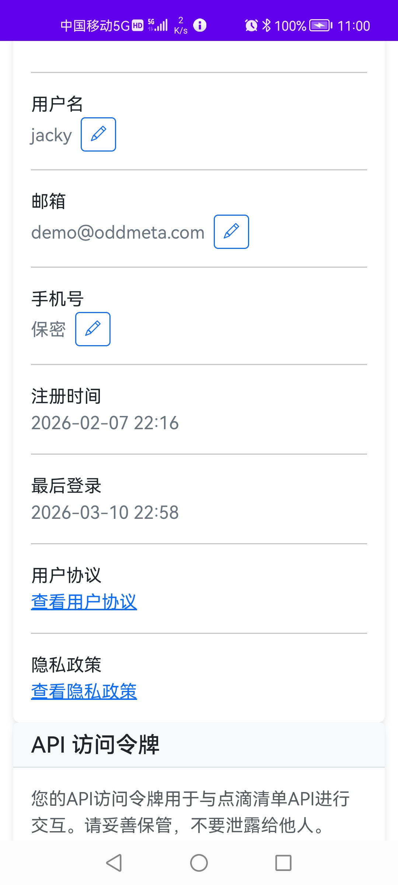

### 3.2 提醒管理
- **生日提醒**：支持阳历/农历，提前3天开始提醒
- **节日提醒**：支持阳历/农历，提前1天+当天提醒
- **闹钟提醒**：按设置时间触发，支持重复提醒
- **待办提醒**：支持提前提醒和循环提醒

注册用户可以自行新增各种类型的提醒任务。

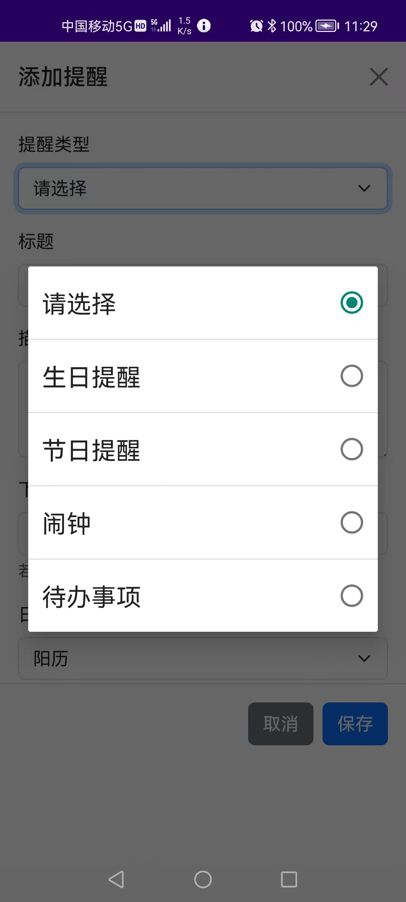

也可以对现有的提醒任务进行必要的操作，比如：编辑、禁用、删除、确认，延迟等等。

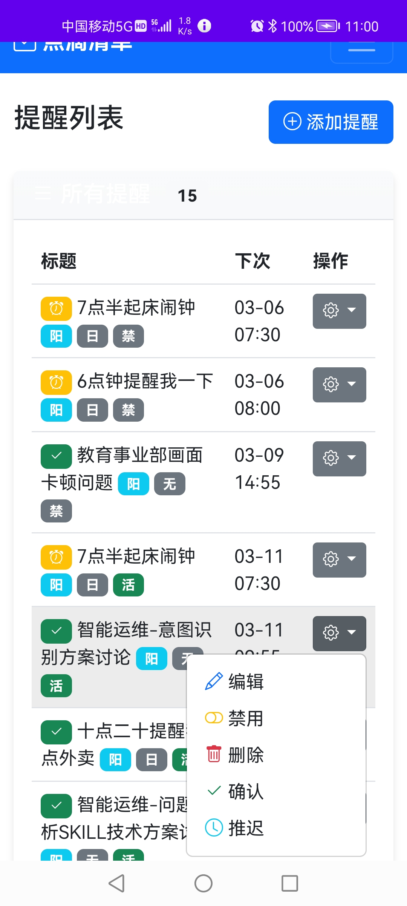

比如：对某一个提醒任务进行修改操作。

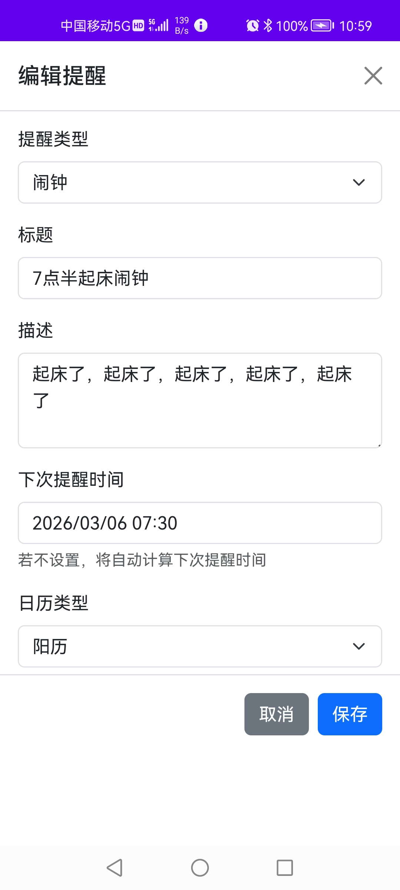

还可以以不同的方式查看提醒列表，如：当日提醒任务、已到期未确认通知、未到期提醒。

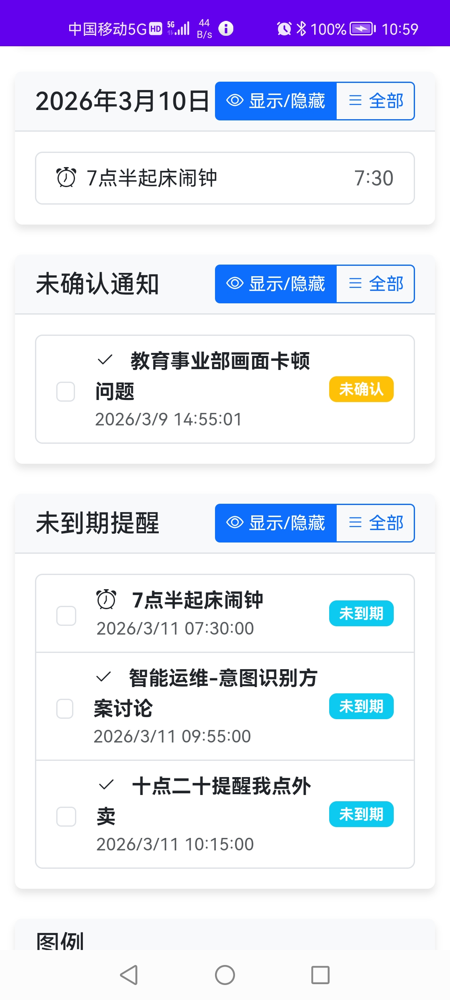

### 3.3 日历功能
- 日历视图：展示所有循环实例

  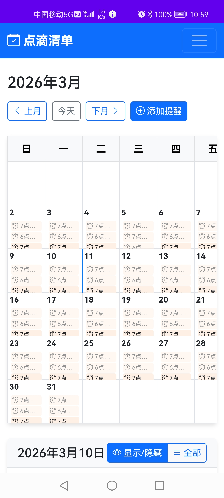

- 列表视图：合并显示提醒记录

  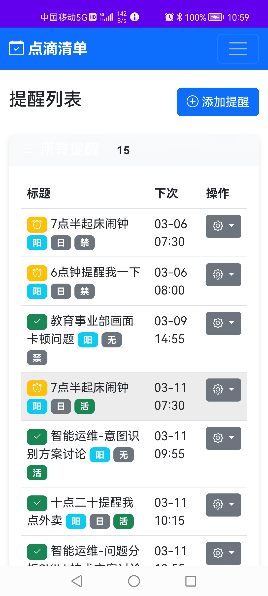

- 阳历/农历双日历支持

### 3.4 通知功能
- WebSocket实时推送
- Android系统通知
- 桌面端系统通知
- 邮件通知（可选）
- 企微机器人通知（可选）

用户可以根据自己的需要来添加适合自己的实时通知机器人。

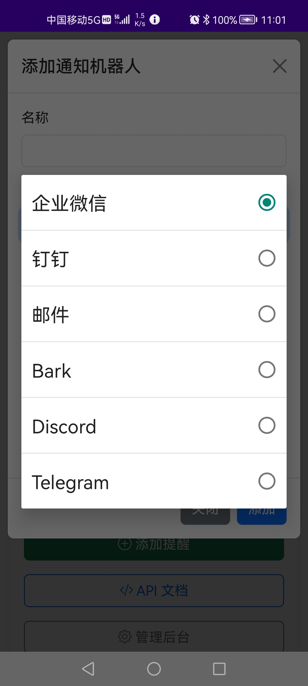

成功添加的通知机器人会在**个人信息**界面处看到

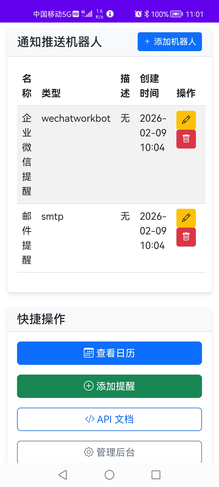

### 3.5 提醒规则

#### 生日提醒规则
- 提前提醒：生日前3天开始，每天早8点提醒
- 当天提醒：按设置时间提醒
- 循环处理：自动计算下一年度生日

#### 节日提醒规则
- 提前提醒：节日前1天早8点提醒
- 当天提醒：当天早8点再次提醒
- 循环处理：自动计算下一年度节日

#### 待办提醒规则
- 提前提醒：待办时间前5分钟开始
- 当天提醒：每6小时提醒一次
- 过期提醒：每天提醒一次直到确认

#### 闹钟提醒规则
- 按时提醒：按设置时间触发
- 重复提醒：未确认时每5分钟重复，最多3次
- 循环闹钟：每天按设置时间触发

## 四、核心模块说明

### 4.1 数据模型（models.py）
- **Reminder模型**：存储提醒基本信息
- **Notification模型**：存储通知记录
- **User模型**：Django内置用户模型

### 4.2 API接口（views.py）
- 提醒的增删改查（CRUD）
- 待处理提醒查询
- 提醒确认接口
- 提醒延迟接口
- 批量确认接口

### 4.3 WebSocket通信（consumers.py）
- 用户实时连接管理
- 提醒实时推送
- 心跳保活机制

### 4.4 定时任务（management commands）
- check_reminders：每分钟检查并触发提醒
- create_test_data：创建测试数据

### 4.5 通知模块（oddnotify）
- 邮件通知
- 企微机器人通知
- 钉钉机器人通知
- WebSocket客户端通知
- Android系统通知

## 五、接口说明

### 5.1 REST API
| 方法   | 路径                         | 功能           |
| ------ | ---------------------------- | -------------- |
| GET    | /api/reminders/              | 获取提醒列表   |
| POST   | /api/reminders/              | 创建提醒       |
| GET    | /api/reminders/{id}/         | 获取提醒详情   |
| PUT    | /api/reminders/{id}/         | 更新提醒       |
| DELETE | /api/reminders/{id}/         | 删除提醒       |
| POST   | /api/reminders/{id}/confirm/ | 确认提醒       |
| POST   | /api/reminders/{id}/snooze/  | 延迟提醒       |
| GET    | /api/reminders/pending/      | 获取待处理提醒 |

### 5.2 WebSocket
| 事件                  | 说明         |
| --------------------- | ------------ |
| connect               | 用户连接     |
| disconnect            | 用户断开     |
| reminder_notification | 推送提醒通知 |
| ping/pong             | 心跳保活     |

## 六、数据库表结构

### 6.1 reminders_reminder（提醒表）
| 字段               | 类型     | 说明           |
| ------------------ | -------- | -------------- |
| id                 | Integer  | 主键           |
| user_id            | Integer  | 外键，关联用户 |
| reminder_type      | Varchar  | 提醒类型       |
| title              | Varchar  | 标题           |
| description        | Text     | 描述           |
| calendar_type      | Varchar  | 日历类型       |
| month              | Integer  | 月份           |
| day                | Integer  | 日期           |
| hour               | Integer  | 小时           |
| minute             | Integer  | 分钟           |
| repeat_type        | Varchar  | 重复类型       |
| is_active          | Boolean  | 是否激活       |
| next_reminder_time | DateTime | 下次提醒时间   |
| last_reminder_time | DateTime | 上次提醒时间   |
| repeat_count       | Integer  | 已重复次数     |
| max_repeat_count   | Integer  | 最大重复次数   |
| end_date           | Date     | 截止日期       |

### 6.2 reminders_notification（通知记录表）
| 字段              | 类型     | 说明           |
| ----------------- | -------- | -------------- |
| id                | Integer  | 主键           |
| reminder_id       | Integer  | 外键，关联提醒 |
| notification_type | Varchar  | 通知类型       |
| is_sent           | Boolean  | 是否已发送     |
| sent_at           | DateTime | 发送时间       |

## 七、版本历史

| 版本 | 日期         | 说明                         |
| ---- | ------------ | ---------------------------- |
| V1.0 | 2026年1月    | 初始版本，基本功能完成       |
| V1.1 | 2026年2月    | 优化提醒规则，增加企微通知   |
| V1.3 | 2026年3月9日 | 支持electron桌面端，全端兼容 |

## 八、开发团队

- 开发人员：catherine@oddmeta.com
- 源代码仓库：https://gitee.com/oddmeta/reminders

---

**声明**：本软件为独立开发，未使用任何第三方商业软件的核心代码。